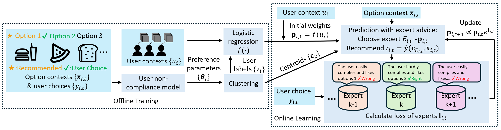
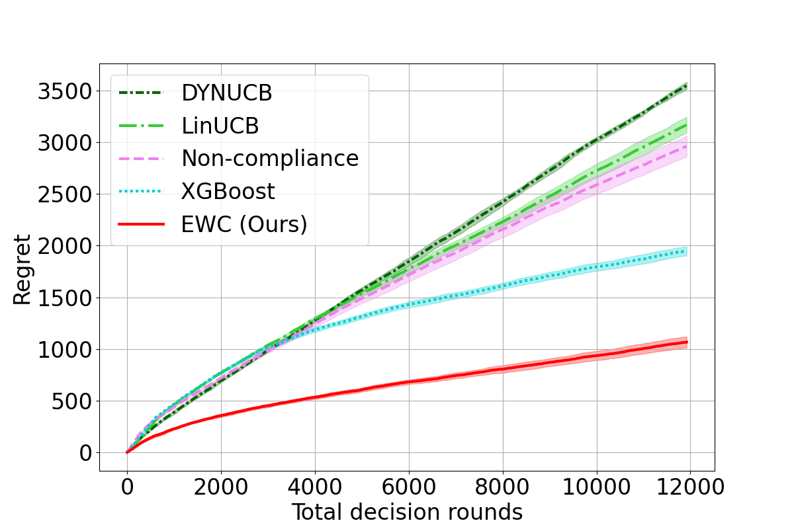
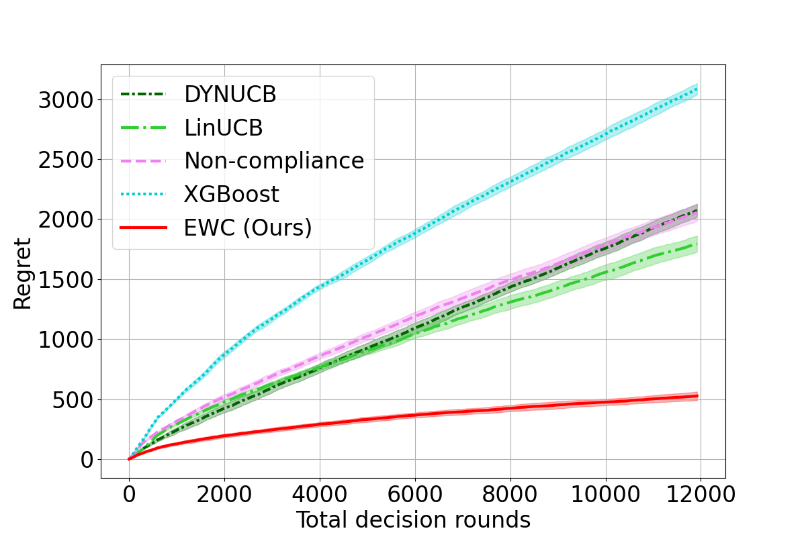
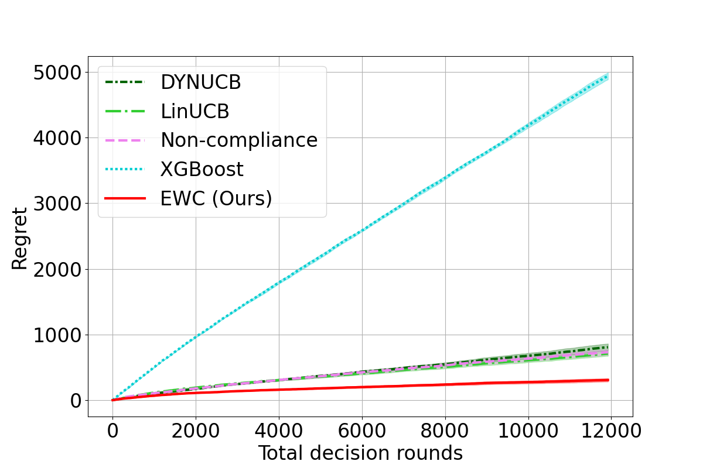
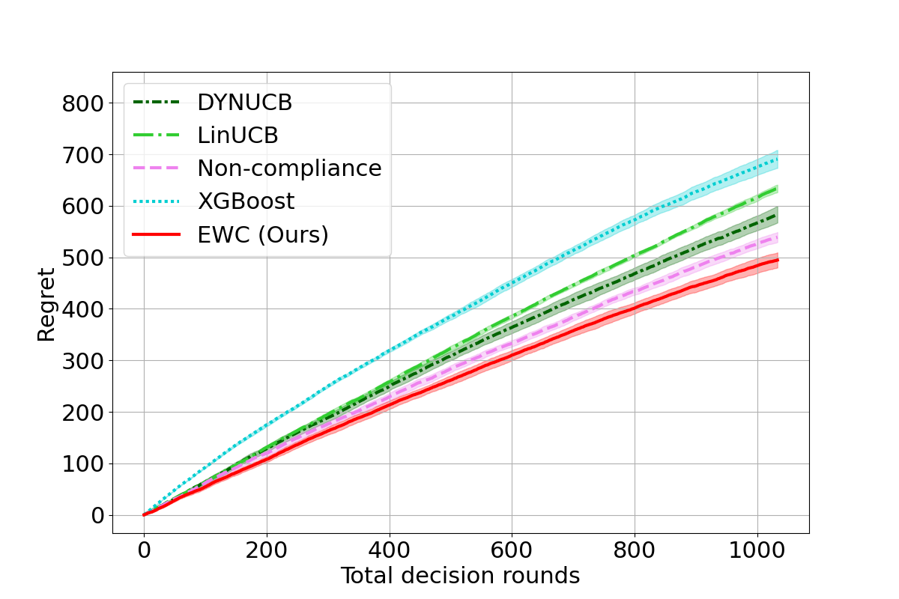

# The Nah Bandit

This is the codebase for our paper:  
**["The Nah Bandit: Modeling User Non-compliance in Recommendation Systems"](https://arxiv.org/abs/2408.07897)**.

In this paper, we address a key problem in recommendation systems: users can easily opt out of recommended options and revert to their baseline behavior. This phenomenon is common in real-world scenarios such as shopping and mobility recommendations. We name this problem the **Nah Bandit**, which lies between a typical bandit setup and supervised learning. The comparison is shown below:

|                          | User selects from **recommended** options | User selects from **all** options |
|--------------------------|------------------------------------------|----------------------------------|
| User is influenced by recommendations   | Bandit       | **Nah Bandit** (This work)     |
| User is **not** influenced by recommendations | N/A          | Supervised Learning            |

We propose a **user non-compliance model** to solve the Nah Bandit problem, which uses a linear function to parameterize the **anchoring effect** (user’s dependence on the recommendation). Based on this model, we propose the **Expert with Clustering (EWC)** algorithm to handle the Nah Bandit problem.

---

## 🧠 EWC Overview

<figure style="text-align: center;">

<figcaption>Figure 1: In the offline training phase, a user non-compliance model learns user preference parameters based on option contexts and user choices. These preference parameters are then grouped into clusters, with the cluster centroids serving as experts. User contexts and their cluster labels are used to train a logistic regression model to predict the initial weights of the experts. In the online learning phase, EWC selects an expert for each recommendation. After observing the user's choice, EWC calculates the loss for each expert and updates their weights accordingly.</figcaption>
</figure>

---

## 📊 Experimental Results

This repository includes experiments on **travel route recommendation** and **restaurant recommendation**. Experimental results show that EWC outperforms both supervised learning and traditional contextual bandit approaches.

<div>
  <figure style="display: inline-block; margin: 10px;">
    
    <figcaption style="text-align: center;">&beta; = 0</figcaption>
  </figure>
  <figure style="display: inline-block; margin: 10px;">
    
    <figcaption style="text-align: center;">&beta; = 1</figcaption>
  </figure>
  <figure style="display: inline-block; margin: 10px;">
    
    <figcaption style="text-align: center;">&beta; = 10</figcaption>
  </figure>
  <div style="margin-top: 10px; font-weight: bold; font-size: 18px;">
    Figure 2: Regret of Expert with Clustering (EWC, Ours) and other baselines (DYNUCB, LinUCB, the user non-compliance model, and XGBoost) on travel route recommendation data. The x-axis denotes decision rounds; the y-axis shows regret (lower is better). EWC consistently outperforms baselines under different user compliance levels (&beta;). Higher &beta; means users are more willing to comply to recommendations. 
  </div>
</div>

<figure style="text-align: center;">

<figcaption>Figure 3: Regret of Expert with Clustering (EWC, Ours) and other baselines (XGBoost, LinUCB, DYNUCB, and the user non-compliance model) on restaurant recommendation data. EWC achieves lower regret than all baselines across all decision rounds.</figcaption>
</figure>

---

## 🔧 Setup & Data Generation

### Travel Route Recommendation

To generate synthetic travel route data:

```bash
cd travel_route_rec/data_generation
python data_gen.py --beta_scaler 0
```

- `--beta_scaler` controls the compliance level of the user population.
- Try values like `1` or `10` as used in the paper.

---

## 🚀 Running Experiments

### Travel Route Recommendation

Run the main experiment:

```bash
cd ../
python main.py --NUM_TEST 5 --beta_scaler 0
```

Plot the results:

```bash
python plot_result.py --beta_scaler 0
```

Plot the **ablation study**:

```bash
python plot_result.py --beta_scaler 0 --EXPERIMENT_NAME ablation_study
```

---

### Restaurant Recommendation

Run the experiment: 

```bash
cd restaurant_rec
python main.py --NUM_TEST 5
```

Plot the results:

```bash
python plot_result.py
```

Plot the **ablation study**:

```bash
python plot_result.py --EXPERIMENT_NAME ablation_study
```

---

## 📎 Notes

- Ensure all dependencies are installed (see `environment.yml` if available).
- For questions or issues, feel free to open an Issue or contact the authors.

---
