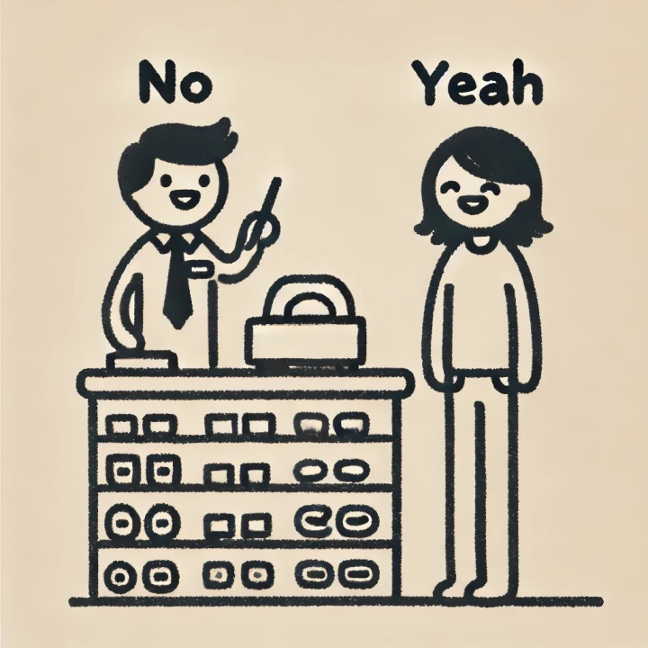

<h1 style="color: #2c3e50; border-bottom: 2px solid #3498db; padding-bottom: 10px; margin-bottom: 15px;">The Nah Bandit: Modeling User Non-compliance in Recommendation Systems</h1>

  <strong>Tianyue Zhou, Jung-Hoon Cho, Cathy Wu</strong> 
  ShanghaiTech University, Massachusetts Institute of Technology 
  <em>IEEE Transactions on Control of Network Systems</em>

  <a href="https://arxiv.org/abs/2408.07897" style="background-color: #3498db; color: white; padding: 8px 15px; border-radius: 4px; text-decoration: none; margin: 0 10px;">📚 Arxiv</a>
  <a href="https://github.com/TianyueJo/The-Nah-Bandit" style="background-color: #2ecc71; color: white; padding: 8px 15px; border-radius: 4px; text-decoration: none; margin: 0 10px;">💻 Code</a>

<section style="background-color: #f8f9fa; padding: 20px; border-radius: 8px; margin-bottom: 30px;">
  <h2 style="color: #2c3e50; border-bottom: 1px solid #ddd; padding-bottom: 8px;">Abstract</h2>
  

    Recommendation systems now pervade the digital world, ranging from advertising to entertainment. However, it remains challenging to implement effective recommendation systems in the physical world, such as in mobility or health. This work focuses on a key challenge: in the physical world, it is often easy for the user to opt out of taking <em>any</em> recommendations if they are not to her liking, and to fall back to her baseline behavior. It is thus crucial in cyber-physical recommendation systems to operate with an interaction model that is aware of such user behavior, lest the user abandon the recommendations altogether.
  

  

    This paper thus introduces Nah Bandit, a tongue-in-cheek reference to describe a Bandit problem where users can say 'nah' to the recommendation and opt for their preferred option instead. As such, this problem lies in between a typical bandit setup and supervised learning.
    We model the user non-compliance by parameterizing an anchoring effect of recommendations on users. We then propose the Expert with Clustering (EWC) algorithm, a hierarchical approach that incorporates feedback from both recommended and non-recommended options to accelerate user preference learning.
  

  

    In a recommendation scenario with \(N\) users, \(T\) rounds per user, and \(K\) clusters, EWC achieves a regret bound of \(O(N\sqrt{T\log K} + NT)\), achieving superior theoretical performance in the short term compared to LinUCB algorithm.
    Moreover, we show that this bound decreases further as the user compliance rate increases.
    Experimental results also highlight that EWC outperforms both supervised learning and traditional contextual bandit approaches.
  

</section>

<section style="margin-bottom: 30px;">
  <h2 style="color: #2c3e50; border-bottom: 1px solid #ddd; padding-bottom: 8px;">The Nah Bandit</h2>

  

    In this paper, we address a key problem in recommendation systems: users can easily opt out of recommended options and revert to their baseline behavior. This phenomenon is common in real-world scenarios such as shopping and mobility recommendations. We name this problem the <strong>Nah Bandit</strong>, which lies between a typical bandit setup and supervised learning.
  

  
  

    <table style="width: 100%; border-collapse: collapse; margin: 15px 0;">
      <thead>
        <tr style="background-color: #3498db; color: white;">
          <th style="padding: 12px; text-align: left; border: 1px solid #ddd;"></th>
          <th style="padding: 12px; text-align: center; border: 1px solid #ddd;">User selects from <strong>recommended</strong> options</th>
          <th style="padding: 12px; text-align: center; border: 1px solid #ddd;">User selects from <strong>all</strong> options</th>
        </tr>
      </thead>
      <tbody>
        <tr>
          <td style="padding: 12px; border: 1px solid #ddd; font-weight: bold;">User is influenced by recommendations</td>
          <td style="padding: 12px; border: 1px solid #ddd; text-align: center;">Bandit</td>
          <td style="padding: 12px; border: 1px solid #ddd; text-align: center; background-color: #e8f4fc;"><strong>Nah Bandit</strong> (This work)</td>
        </tr>
        <tr>
          <td style="padding: 12px; border: 1px solid #ddd; font-weight: bold;">User is <strong>not</strong> influenced by recommendations</td>
          <td style="padding: 12px; border: 1px solid #ddd; text-align: center;">N/A</td>
          <td style="padding: 12px; border: 1px solid #ddd; text-align: center;">Supervised Learning</td>
        </tr>
      </tbody>
    </table>
  

 

    For instance, consider a customer shopping in a physical store—where all items are openly displayed in the showcases. A store clerk might recommend certain items to a customer, but the customer does not always purchase the recommended ones. The customer can choose any item in the showcases that he prefers, and the clerk can observe which items the customer eventually buys. 

  <table style="width: 100%; border-collapse: collapse;">
  <tr>
    <td style="text-align: center; padding: 10px;">
      
      
User goes 'yeah'

    </td>
    <td style="text-align: center; padding: 10px;">
      
      
User goes 'nah'

    </td>
</table>

<section style="margin-bottom: 30px;">
  <h2 style="color: #2c3e50; border-bottom: 1px solid #ddd; padding-bottom: 8px;">User Non-compliance Model</h2>

  

  We propose a <strong>user non-compliance model</strong> to address the Nah Bandit problem. This model extends the standard contextual bandit framework by introducing a recommendation-strength variable into the option context, which explicitly captures how prominently an item is recommended to the user. Using a linear parameterization, our approach simultaneously learns: (1) the user's inherent preferences and (2) their user's dependence on the recommendation. This approach reduces the bias in the learning process that might be introduced by the anchoring effect, thereby preventing the user non-compliance model from falling into sub-optimal recommendations. 
  

</section>

<section style="margin-bottom: 30px;">
  <h2 style="color: #2c3e50; border-bottom: 1px solid #ddd; padding-bottom: 8px;">EWC Algorithm</h2>
  Based on the user non-compliance model, we propose the <strong>Expert with Clustering (EWC)</strong> algorithm to handle the Nah Bandit problem. EWC includes offline training phase and online learning phase. In the offline training phase, a user non-compliance model learns user preference parameters based on option contexts and user choices. These preference parameters are then grouped into clusters, with the cluster centroids serving as experts. User contexts and their cluster labels are used to train a logistic regression model to predict the initial weights of the experts. In the online learning phase, EWC selects an expert for each recommendation. After observing the user's choice, EWC calculates the losses of each experts and updates their weights accordingly.
  

    
    

      <b>Figure 1:</b> An overview of the Expert with Clustering (EWC) algorithm for the Nah Bandit problem. 
    

  

</section>

<section style="margin-bottom: 30px;">
  <h2 style="color: #2c3e50; border-bottom: 1px solid #ddd; padding-bottom: 8px;">Experimental Results</h2>
  

    We tested EWC and baseline approaches on <strong>travel route recommendation</strong> and <strong>restaurant recommendation</strong>. Results show that EWC outperforms both supervised learning and traditional contextual bandit approaches.
  

  
  <h3 style="color: #2c3e50; margin-top: 25px;">Travel Route Recommendation</h3>
  
<table style="width: 100%; border-collapse: collapse;">
  <tr>
    <td style="text-align: center; padding: 10px;">
      
      
β=0

    </td>
    <td style="text-align: center; padding: 10px;">
      
      
β=1

    </td>
    <td style="text-align: center; padding: 10px;">
      
      
β=10

    </td>
  </tr>
</table>
  
  

    <b>Figure 2:</b> Regret of EWC (Ours) vs. DYNUCB, LinUCB, the user non-compliance model, and XGBoost on travel route data. Lower regret is better. Higher β implies higher user compliance.
  

  
  <h3 style="color: #2c3e50; margin-top: 40px;">Restaurant Recommendation</h3>
  
  

    
    

      <b>Figure 3:</b> Regret comparison on restaurant recommendation. EWC consistently outperforms all baselines across rounds.
    

  

</section>

<section style="background-color: #f8f9fa; padding: 20px; border-radius: 8px; margin-top: 40px;">
  <h2 style="color: #2c3e50; border-bottom: 1px solid #ddd; padding-bottom: 8px;">BibTex</h2>
  <pre style="background-color: white; padding: 15px; border-radius: 4px; overflow-x: auto; font-family: monospace; border: 1px solid #ddd;">
@misc{zhou2024nahbanditmodelinguser,
      title={The Nah Bandit: Modeling User Non-compliance in Recommendation Systems}, 
      author={Tianyue Zhou and Jung-Hoon Cho and Cathy Wu},
      year={2024},
      eprint={2408.07897},
      archivePrefix={arXiv},
      primaryClass={cs.LG},
      url={https://arxiv.org/abs/2408.07897}, 
}</pre>
</section>

